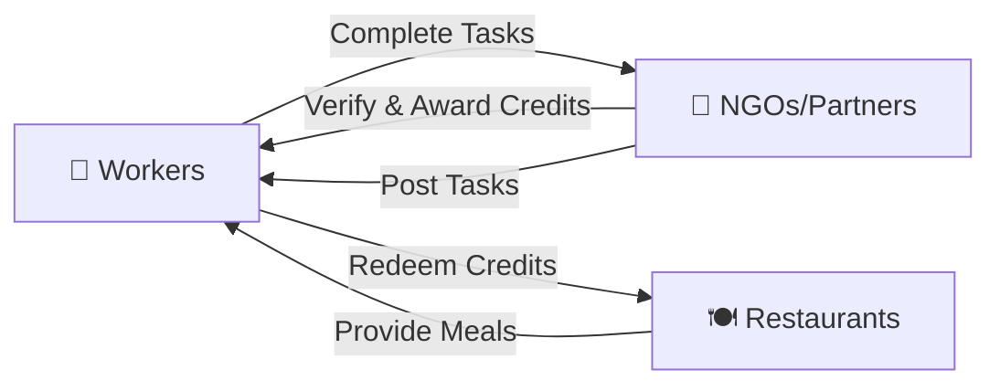

# 🍽️ Job4Meal

[](https://nextjs.org/)
[](https://www.typescriptlang.org/)
[](https://firebase.google.com/)
[](https://tailwindcss.com/)
[](LICENSE)
[](https://vercel.com)

> **"Dignity in every meal earned."**

A revolutionary platform that transforms aid into empowerment by enabling workers to earn meal credits through verified microtasks. Built with dignity, powered by technology.

---

## 📖 Table of Contents

- [Overview](#-overview)
- [Features](#-features)
- [Tech Stack](#%EF%B8%8F-tech-stack)
- [Getting Started](#-getting-started)
- [Architecture](#-architecture)
- [Deployment](#-deployment)
- [License](#-license)

---

## 🌟 Overview

### The Problem
Traditional aid creates dependency. Millions need food **today** but also want **dignity through work**.

### Our Solution
Job4Meal connects three key players:



**Workers** earn meal credits → **NGOs** verify work → **Restaurants** provide meals

## ✨ Features

<table>
<tr>
<td width="33%">

### 👷 Workers
- 🗺️ Find nearby tasks
- 📸 Submit proof
- 💳 Earn meal credits
- 🍽️ Redeem at partners

</td>
<td width="33%">

### 🏢 NGOs/Partners
- ➕ Post microtasks
- ✅ Verify submissions
- 📊 Track impact
- 🤝 Manage redemptions

</td>
<td width="33%">

### 👨‍💼 Admins
- 📈 System analytics
- 👥 User management
- 🏢 Organization oversight
- 📊 Impact metrics

</td>
</tr>
</table>

## 🛠️ Tech Stack

```
┌─────────────────────────────────────────────┐
│  Frontend: Next.js 14 + TypeScript          │
│  Styling: Tailwind CSS + Framer Motion      │
│  State: Zustand                             │
├─────────────────────────────────────────────┤
│  Backend: Firebase                          │
│  - Authentication (Email/Password)          │
│  - Firestore Database                       │
│  - Cloud Storage                            │
├─────────────────────────────────────────────┤
│  Deployment: Vercel                         │
└─────────────────────────────────────────────┘
```

## 🚀 Getting Started

### Installation

```bash
# Clone repository
git clone <your-repo-url>
cd Job4meal

# Install dependencies
npm install

# Set up environment variables
cp .env.local.example .env.local
# Edit .env.local with your Firebase credentials

# Run development server
npm run dev
```

Visit `http://localhost:3000` 🎉

### Firebase Setup

1. Create project at [Firebase Console](https://console.firebase.google.com)
2. Enable **Authentication** (Email/Password)
3. Enable **Firestore Database**
4. Enable **Cloud Storage**
5. Copy config to `.env.local`

### Environment Variables

```env
NEXT_PUBLIC_FIREBASE_API_KEY=your_api_key
NEXT_PUBLIC_FIREBASE_AUTH_DOMAIN=your_project.firebaseapp.com
NEXT_PUBLIC_FIREBASE_PROJECT_ID=your_project_id
NEXT_PUBLIC_FIREBASE_STORAGE_BUCKET=your_project.appspot.com
NEXT_PUBLIC_FIREBASE_MESSAGING_SENDER_ID=your_sender_id
NEXT_PUBLIC_FIREBASE_APP_ID=your_app_id
NEXT_PUBLIC_FIREBASE_MEASUREMENT_ID=your_measurement_id
```

## 👥 Demo Users

After seeding, you can login with these roles:

| Role | Phone | Password | Purpose |
|------|-------|----------|---------|
| Worker | +1234560001 | (any 6 digits in demo mode) | See task listing, claim tasks, earn credits |
| Worker | +1234560002 | (any 6 digits) | Different location, submitted task |
| NGO Staff | +1234560010 | (any 6 digits) | Create tasks, verify submissions |
| Admin | +1234560099 | (any 6 digits) | System overview, all analytics |

**Demo Mode**: The app runs in demo mode by default. Enter any phone number and any 6-digit OTP to login.

## 🏛️ Architecture

### System Flow

```
┌────────────────────────────────────────────────────────────┐
│                      USER INTERFACE                           │
│  [👷 Worker]    [🏢 NGO]    [👨‍💼 Admin]                      │
└────────────────────────────────────────────────────────────┘
                            │
                            ↓
┌────────────────────────────────────────────────────────────┐
│                    NEXT.JS 14 APP                           │
│  - Server Components                                        │
│  - Client Components                                        │
│  - API Routes                                               │
└────────────────────────────────────────────────────────────┘
                            │
                            ↓
┌────────────────────────────────────────────────────────────┐
│                  FIREBASE BACKEND                          │
│  [🔐 Auth]  [📊 Firestore]  [💾 Storage]              │
└────────────────────────────────────────────────────────────┘
```

### Data Model

```
users/
  ├─ {userId}
  │   ├─ role: "worker" | "ngo" | "admin"
  │   ├─ wallet: { mealCredits: number }
  │   └─ verified: boolean

tasks/
  ├─ {taskId}
  │   ├─ title, description, reward
  │   ├─ status: "open" | "claimed" | "completed"
  │   └─ location: { lat, lng }

redemptions/
  └─ {redemptionId}
      ├─ workerId, partnerId
      ├─ creditsUsed
      └─ timestamp
```

## 📊 Key Metrics

- 🍽️ **Meals Earned**: Track total meals provided
- ✅ **Tasks Completed**: Monitor platform activity  
- 👥 **Active Workers**: Growing community
- 🏢 **Partner NGOs**: Expanding network

## 🔒 Security

- 🔐 Firebase Authentication
- 🛡️ Role-based access control
- 📝 Firestore security rules
- 📸 Photo verification system

## 🚀 Deployment

### Deploy to Vercel

1. Push code to GitHub/GitLab
2. Import project on [Vercel](https://vercel.com)
3. Add environment variables
4. Deploy! 🎉

**See [DEPLOYMENT.md](DEPLOYMENT.md) for detailed instructions.**

### Commands

```bash
# Development
npm run dev

# Build
npm run build

# Production
npm start
```

## 📝 Project Structure

```
Job4Meal/
├── app/              # Next.js pages & routes
├── components/       # Reusable React components
├── lib/              # Utilities & Firebase config
├── public/           # Static assets
└── .env.local        # Environment variables
```

## 📄 License

[MIT License](LICENSE) - Open source for social impact

## 🤝 Contributing

Contributions are welcome! Please read our contributing guidelines before submitting PRs.

## 📞 Support

- 📧 Email: aayushigoel73@gmail.com, msabhishekanni10@gmail.com

## 🙏 Acknowledgments

Built with passion for social impact. Special thanks to all NGOs and community partners working to end hunger.

---

<div align="center">

**Built with ❤️ for a hunger-free world**

*"Dignity in every meal earned."*

[⭐ Star this repo](../../stargazers) | [🐛 Report Bug](../../issues) | [💡 Request Feature](../../issues)

</div>
